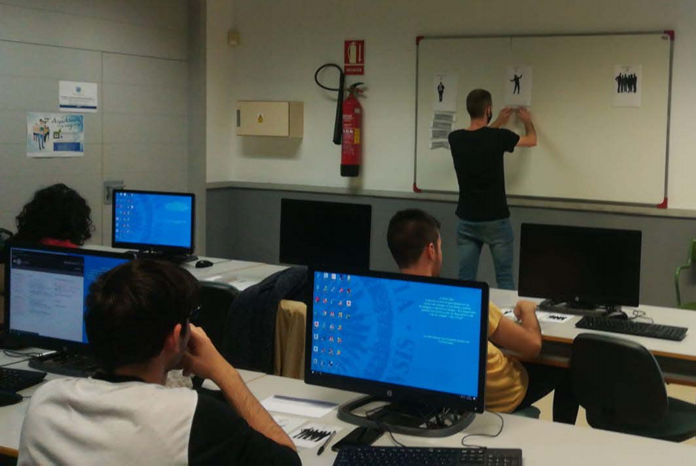
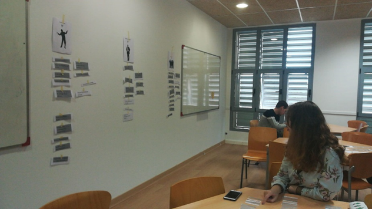

# Cada Oveja con su Pareja

Es un juego de asociación con 39 cartas por alumno de elaboración propia, donde primero de forma individual y luego en un proceso de compartir en la pizarra, asocian responsabilidades a los tres roles de Scrum.

La manipulación de las cartas consigue involucrar a los alumnos en el juego y ofrece un nivel adicional de complejidad a la revisión de una lista de responsabilidades.

Posteriormente, los alumnos se turnan para compartir la asociación elegida, explicándola y unificándola con el resto de sus compañeros, sacando al alumno de su zona de confort colocando físicamente la ficha sobre la pizarra.

Version en [inglés](https://www.tastycupcakes.org/2014/01/scrum-roles-and-responsibilities-game/)

## Notas sobre la actividad

En lugar de tarjetas o cartas, simplemente se pueden utilizar papelitos que se entregan a los alumnos dentro de un sobre totalmente desordenados.

El hecho de tener que manipular las fichas es básico para el exito de esta actividad.

Se tiene dos tamaños diferentes en la fichas, el [primero](fichas.pdf) es para cada alumno, el [segundo](grandes.pdf) para utilizar sobre la pizarra.

## Imagenes de la experiencia

