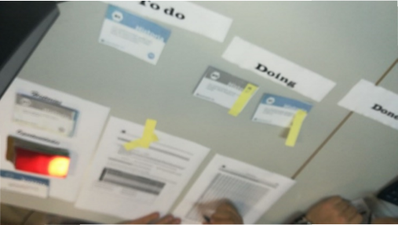

<link rel="stylesheet" type="text/css" href= "../estilo.css" media="screen" />

# Cartas de simulación de Scrum

Esta actividad es la ejecución del [juego] (https://scrumcardgame.com/)
elaborado por SCRUM CARD GAME by Timofey (Tim) Yevgrashyn se licencia bajo Creative Commons
Attribution-ShareAlike 4.0 International License.

Este juego  permiten a los alumnos profundizar en las tareas de control y ejecución del workflow con Scrum. En este caso, se utiliza un tablero Kanban que permite a los jugadores experimentar el trabajo de sprint de Scrum y discutir muchos problemas y temas que suceden en la vida real mientras trabajan en un equipo de Scrum. La discusión en el tablero será muy cercana a la experiencia real de trabajar en un equipo Scrum, ya que las tarjetas de oportunidad se han escrito extrayendo las situaciones de casos reales de desarrollo de software, como el problema de la caída de un servidor. O un evento que sea un permiso parental en el equipo.

## PUNTOS DE APRENDIZAJE

Los jugadores deben conocer bien como funciona Scrum.

Es un juego de simulación que facilita reforzar el conocimiento de Scrum.

## TEMPORIZACIÓN

Al menos 20 minutos.

## MATERIAL

*   [Material en español](Scrum_Card-Game_ES.pdf)

*   [Instrucciones en inglés](Scrum_Card_Game_Instructions.pdf)

## INSTRUCCIONES DE EJECUCIÓN

Están reflejadas en la documentación.

Se dispondrá de un juego de cartas por cada cuatro alumnos.

Estos grupos de alumnos desarrollarán el juego por equipos.

## Imagenes de la experiencia

