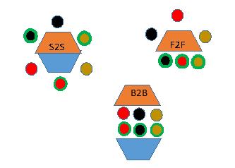

<link rel="stylesheet" type="text/css" href= "../estilo.css" media="screen" />

# Construyamos un producto

En las primeras etapas del desarrollo de un aplicación software la comunicación es un punto clave. Se necesita un código común. Emisores y receptores deben compartir un código para expresar los mensajes a partir de los cuales se establecerán las características del producto a cosntruir. Este código es parte intrínsea de las personas que hablan un mismo idioma, tiene un mismo bagaje cultural y experiencia similar. Sin embargo esto condiciones ideales no suelen darse para todos los stakeholders, se debe acordar un código habitulamente muy relacionado con las técnicas de modelado. Otro factor importante es el medio. En la comunicación verbal, el exito se basa en la redundancia. Además de palabras se utiliza el lenguaje gestual y la entonación, incluyendo el feedback de receptor de los mensajes. En los informes escritos hay redundancia mínima y no hay feedback. Además de los problemas derivados del uso de distinto vocabulario y de los distintos medios de comuncación, el conocimiento implicito (no expresado en ningun código) es uno de los principales problemas. Se simplifican cuestionesque pueden ser básicas para el éxito del proyecto.

Proponemos una actividad en dos etapas donde el producto a construir será un producto de papiroflexia, un gorro en la primera fase y un avión en la segunda para destacar la Importancia de la comunicación.

## PUNTOS DE APRENDIZAJE

- Fase 1: Importancia del código utilizado. La complejidad o familiaridad con el código facilitan o impiden la comunicación

- Fase 2: El medio de comunicación y su disponibilidad, agilizan o interfieren en el proyecto.

## TEMPORIZACION

20 minutos (10 para cada fase)

## MATERIALES

- Una hoja de papel de periodico para cada equipo
- Un hoja tamaño A4 de papel reciclado para cada equipo
- Instrucciones gráficas paso a paso para el gorro, [grafico](gorro.jpg)
- Instrucciones textuales paso a paso para el gorro, construir a escala reducida un gorro de papel, [solo por si no sabes](https://www.youtube.com/watch?v=lfY0dubG958)

      1. Partir de una hoja de periódico doblada por el lomo tal como viene de la imprenta.
      2. Marcar un doblez, a la mitad, perpendicular al doblez de lomo del periódico.
      3. Doblar las dos esquinas junto al lomo, hacia el doblez marcado en el paso e, creando una punta triangular.
      4. Levantar los bordes libres del papel (del ancho inicial del periódico) hacia arriba, generando un ligero reborde.
      5. Pegar un trozo de cinta a los lados para unirlo y que el borde no se despliegue, o bien hacer un pequeño pliegue

- Prototipos de gorro

- Instrucciones gráficas del modelo de avión a construir, [grafico](avion.jpg)

## INSTRUCCIONES DE EJECUCIÓN

### Fase 1: Se va a construir un gorro de papel por equipo partiendo de tres tipos distintos de instrucciones. El tipo 1 utilizarán un esquema gráfico de intrucciones, los alumnos de tipo 2 las instrucciones en un texto escrito y los del tipo 3 un modelo a escala del gorro ya hecho.

Definir los grupos de alumnos. Preferiblemente de dos o tres personas, buscando un número similar de equipos de cada tipo

Se distribuyen en áreas distintas del aula por tipos, proporcionando las instrucciones, pero sin que puedan consultarlas.

En ningún momento se dirá que «objeto» se está construyendo. Pero se les indica que ganarán aquellos equipos que acaben antes y demuestren la funcionalidad del objeto.

Se les dará a todos cinco minutos como maximo para la ejecución del proyecto.

Se les pedirá que hagan una demostracción de la funcionalidad en cuanto estén acabados.

### Fase 1: Se construirá un avión de papel en este caso con el mismo modelo de instrucciones gráficas, pero lo que cambiará será el medio de comunicarse, plegadores y gestores.

Formar pares entre los participantes y dar una hoja de instrucciones (con la cara hacia abajo) a una de las personas de cada par (el **gestor**), y entregue una hoja de papel en blanco al otro miembro del par (el **plegador**). Divida las parejas en tres disposiciones: 

-   **S2S**,  sentados lado a lado:

              Solo pliega el plegador, pero ambos pueden ver la hoja de instrucciones tanto como sea necesario.

-   **F2F**, sentados enfrentados (cara a cara):

              El plegador no ve la hoja de instrucciones, pero el gestor puede ver el trabajo del plegador y dar instrucciones

-   **B2B**,  sentados espalda contra espalda:

              Ni el gestor ni el plegador pueden ver el trabajo del otro, pero pueden hablar tanto como quieran

¡Empecemos! la persona con la hoja de instrucciones (*gestor*) la da vuelta y le da instrucciones al otro miembro del par sobre como plegar el origami siguendo las reglas marcadas por el tipo al que pertenece.

A medida que cada grupo completa exitosamente el origami, haga que se pongan de pie y "prueben" la funcionalidad del producto acabado.

El facilitador puede finalizar el ejercicio después de un cierto lapso de tiempo, ya que la B2B podría no lograr terminar la tarea.

## DEBRIEFING

Debatir con los alumnos como se han sentido con los diferentes tipos de instrucciones,

*   ¿Cúal creen que es la mejor?,

*   ¿Sería buena la redundancia?

Valorar la importancia de tener buenos canales de comunicación

Crease a rectangular sheet of paper down the middle. Fold the paper lengthwise (hotdog style). Run your fingernail along the crease, then unfold the paper. You will use this crease as a guide later on.[1]
•	A sheet of newspaper around 29 1⁄2 by 23 1⁄2 inches (75 by 60 cm) will work the best, but you can use a sheet of printer paper to make a smaller doll-sized hat too.
•	
Fold the paper in half widthwise. Bring the narrow ends together, then flatten the paper (hamburger style). Run your fingernail along the crease to sharpen it. Do not unfold the paper.[2]

Fold the top corners to the center crease. Rotate the paper so that the folded edge is along the top of the paper. Fold the top left and right corners to the vertical crease running down the middle of your paper. You will end up with a house shape.[3]

Fold 1 of the flaps along the bottom edge up. There are 2 layers or "flaps" of paper along the bottom edge of your house shape. Take the top flap and fold it upwards. The new crease along the bottom edge of the paper should be flush with the bottom edges of the triangles.[4]

Fold the brim inwards if it is too wide for you. Unfold the brim to reveal a crease. Fold the bottom edge up to this crease, then fold the brim back up, like in the previous step.[5]
•	How wide you make the brim is entirely up to you and your personal tastes. Most people like theirs between 1 and 2 inches (2.5 and 5.1 cm).
Flip the paper over and fold the second flap up too. If you folded the brim twice earlier, you should fold it twice this time around too.[6]

Tape the corners of the brim, if desired. You don't have to do this, but it will give your hat a nicer finish. Wrap pieces of tape around both of the side edges of the brim to hold them together. You can also use glue instead, but let the glue dry.
•	To make an alpine hat, fold the corners of the brim down behind the band so that your hat looks like a triangle. Glue the edges of the brim to the hat.[7]
Open the base of the hat to put it on. For an alpine or Peter Pan look, wear the hat with the triangle parts over your ears. For a bicorn or pirate look, wear the hat with the triangle parts over your forehead instead.
