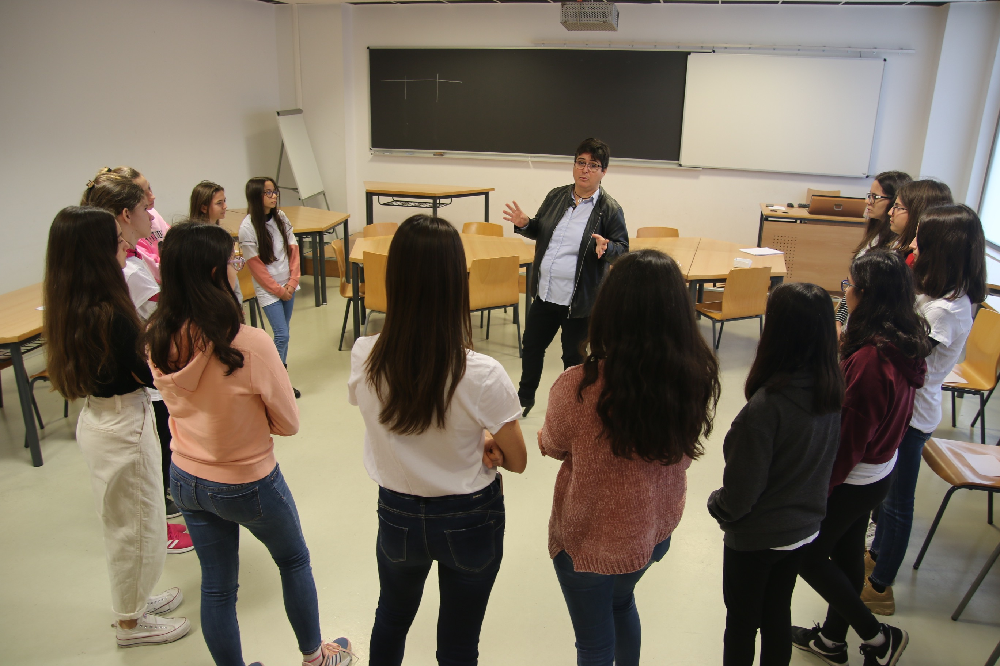

# Contar hasta 33

Se trata de una actividad simple donde el objetivo es contar en voz alta hasta 33, a la mayor velocidad posible (con no mas de 1 segundo entre persona y persona) pero con unas reglas particulares que hacen de algo simple un trabajo que requiere concentración.

## PUNTOS DE APRENDIZAJE

Hay que centrar la atención en el trabajo pendiente

Aprendizaje por prueba y error.

## NUMERO DE PARTICIPANTES

 Tres o mas pero no mas de 20

## TEMPORIZACIÓN

5 min

## INSTRUCCIONES

Se  ponen los participantes en forma de círculo. Hay que decir los números del 1 a 33 en el sentido de las agujas del reloj. Con una única norma:

>“cualquier número divisible por tres o que termine en 3 no se dice y se sustituye por una palmada”.

Si se falla o pasa mas de un segundo, el siguiente empieza la serie hasta llegar a 33

>1 2 clap 4 5 clap 7 8 clap 10 11 clap clap 14 clap 16 17 clap 19 20 clap 22 clap clap 25 26 clap 28 29 clap 31 32 clap

## Imagenes de la experiencia

