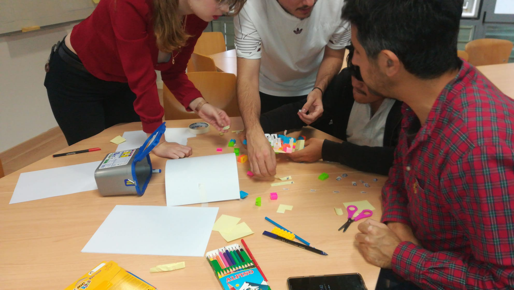

<link rel="stylesheet" type="text/css" href= "../estilo.css" media="screen" />

# El mejor juguete volador jamás construido

Esta es una variación del clásico juego de bloques de Lego para construir un producto en equipos usando iteraciones. En este caso un plano, donde partiendo de una hoja de ruta sobre el producto se incorporan las historias de usuario en tres sprints, prestando especial atención a la revisión del sprint, no tratado en los juegos de simulación anteriores, donde el docente hace el papel del propietario del producto y facilitador del Scrum. A partir de este último rol facilitará ciertos materiales intencionalmente no previstos inicialmente en el juego de construcción como las ruedas.

[Enlace original](https://www.linkedin.com/pulse/scrum-lego-simulation-agile-game-build-plane-ignacio-paz)

## MATERIALES

[Product vision board](productvision.pdf)

[Fichas de producto](ScrumLEGOSimulation.pdf)

## IMAGENES ACTIVIDAD

