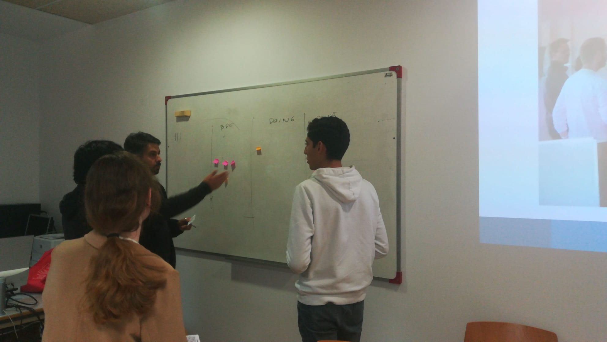
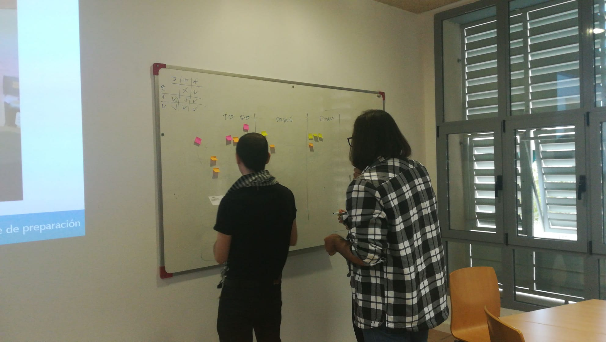

<link rel="stylesheet" type="text/css" href= "../estilo.css" media="screen" />

# Kanban de Colores

Con esta actividad se muestra sobre el tablero kanban la necesidad de la reunión diaria de sincronización del equipo. Utilizando post-it de tres colores (rosa, amarillo y naranja), se simula en dos tandas una serie de movimientos en el tablero a lo largo de tres días de trabajo.

[Enlace en tastycupcakes](https://www.tastycupcakes.org/2018/01/daily-scrum-game/)

La primera tanda sin reunión y la segunda con ella, de forma que se gana si se pasan todas las tarjetas a la columna **Hecho** del tablero kanban, comprobando así que la sincronización mejora el resultado.

## Materiales Necesarios

-   Post-it de tres colores (rosa, amarillo y naranja),

- [Tarjetas](tarjetas.pdf) con las instrucciones.

## IMAGENES ACTIVIDAD

